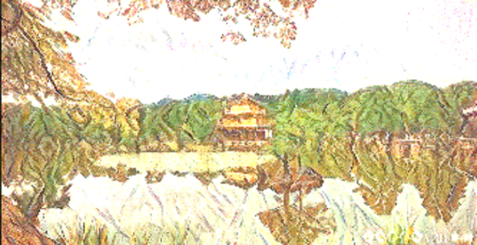
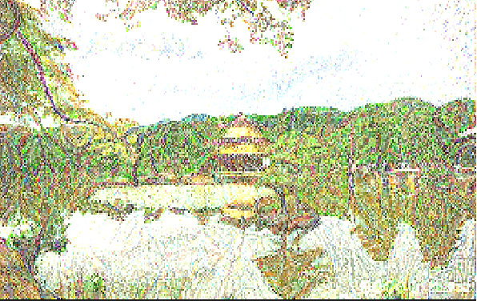

# *Overview*

Neural Style Transfer is a technique used to compose an image in the style of another image. The challenge provided us with 
japanse_garden.jpg as the Content image and picasso_selfpotrait.jpg as the Style Image. The result in the end looked like this:-

# *Content Image*

# *Style Image*

# *Final Image*

# *Imported packages not part of the standard python library.*

1.) numpy - https://docs.scipy.org/doc/numpy-1.15.4/user/

2.) matplotlib - https://matplotlib.org/contents.html

3.) tensorflow - https://www.tensorflow.org/versions/r1.12/api_docs/python/tf

# *Referenced work and papers*

Leon A. Gatys, Alexander S. Ecker, Matthias Bethge - https://arxiv.org/abs/1508.06576 

Official Tensorflow Tutorial - https://github.com/tensorflow/models/blob/master/research/nst_blogpost/4_Neural_Style_Transfer_with_Eager_Execution.ipynb

# *Summary*

## Approach

- The first step of the system was to obtain weigths of VGG19 neural network as mentioned in the original paper.

- The next objective of the system was to visualise the provided images and pre-process them for feeding them into the network.

- To get good feature representation of the Content image, it uses a layer in the 5th convolution block of the network.

- For obtaining Style representation, the model was restricted to 3 alternating layers due to limited GPU power.

- Mean squared error between the feature representations of the orginial image and the generated image were utilized to obtain the Content Cost.

- Mean square distance between the Gram Matrices of the Style image and the Generated image were used for obtaining the Style Cost

- Finally, both the losses were combined with weighting factors Alpha and Beta to get a good mix of the two images.

## Key Learnings

- Higher level layers are better able to capture an object's content and arrangement in input image compared to lower level layers
which are essentially constrained to the pixel values.

- A given input image can be seen as a collection of filters at different heirarchial levels of the CNN.

- A gram matrix is used to minimize the difference between the feature distributions of the style layers. We are not concerned with the 
location of specific features.

- The weighting factors ALPHA and BETA allow us to control if the generated image is closer to the Style Image or the Content image.

## Takeaways

- Higher level Style layers better represent the texture whereas Lower level Style layers better represent the texture.

*Image generated using a single layer in the first block as our Style layer.*

*Image generated using a single layer in the last block as our Style layer.*

-   The system is able to give us an algorithmic understanding of how Neural Networks are able to capture the details of a input image.

